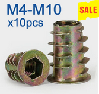
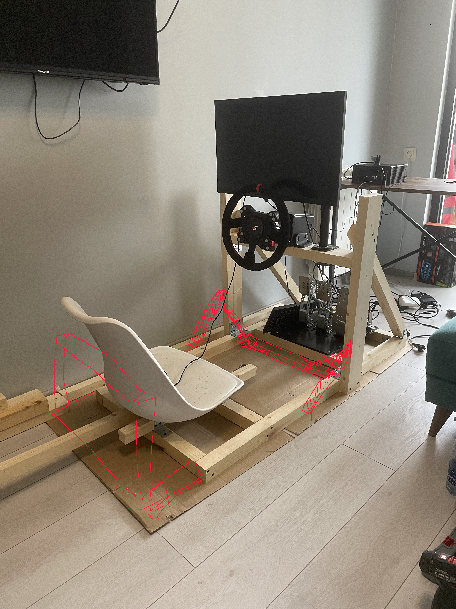

It is possible to assemble a rigid and comfortable wooden sim rig, especially if you don't need to adjust ergonomics and you will be driving mostly alone.

Forget about screws — they can only be used for positioning boards, but during racing they unscrew, the structure becomes non-rigid, so only bolt connections and friction mounting with large washers. Where you can drill a hole through, you can use a bolt with a nut.

Where you cannot, for example, mounting into the end of a board - you can use a threaded insert (it needs to be screwed in and glued) to create a thread or find a hanger bolt.

Threaded insert

Hanger bolt 

The width of the rig should be no more than a doorway - let this be the limit on the width.

For every corner in any plane, a gusset must be provided — this can be a wide but thin board.

---

Жёсткий удобный деревянный симриг собрать можно, особенно если вам не надо менять эргономику и вы будете ездить особенно один

Забудьте про шурупы — их можно использовать только для выставления досок, но в процессе гонок они откручиваются, конструкция становится нежесткой, поэтому только болтовое соединение и крепление на трении с большими шайбами. Там где можно просверлить отверстие насковь можно использовать болт с гайков. 

Там где нет, например, крепление в торец доски - можно использовать футорку threated insert(ее надо вкрутить и посадить на клей). чтобы создать резьбу или найти полушуруп полуболт (hanger bolt)

Футорка

Hanger bolt 

Ширина рига должна быть не больше дверного проёма - пускай это будет ограничение на ширину.

На каждый угол в любой плоскости надо предусматривать косынку — это может быть широкая, но тонкая доска.

